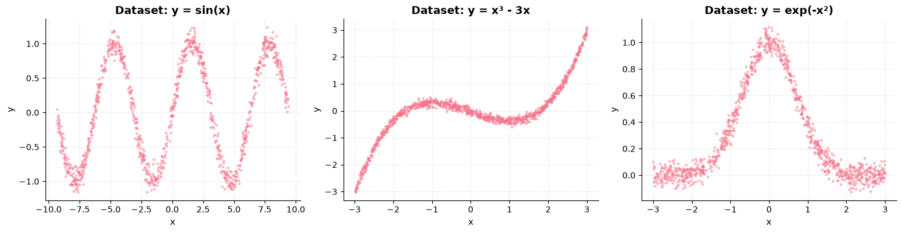
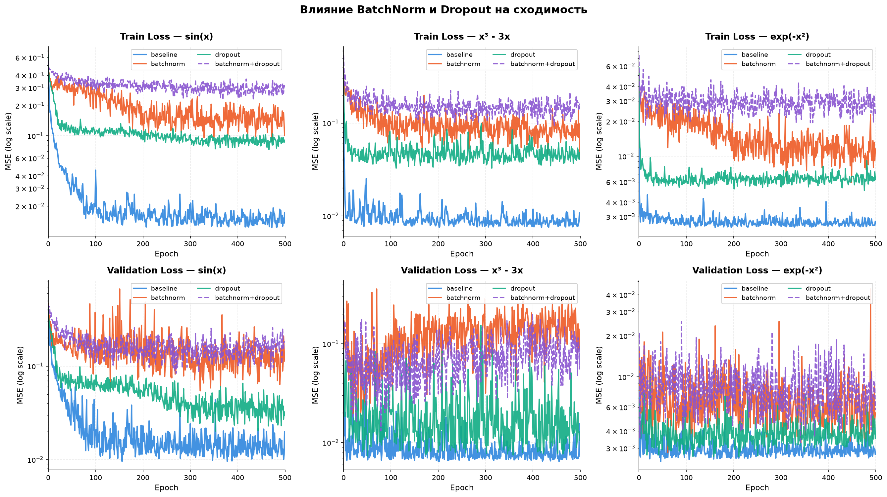
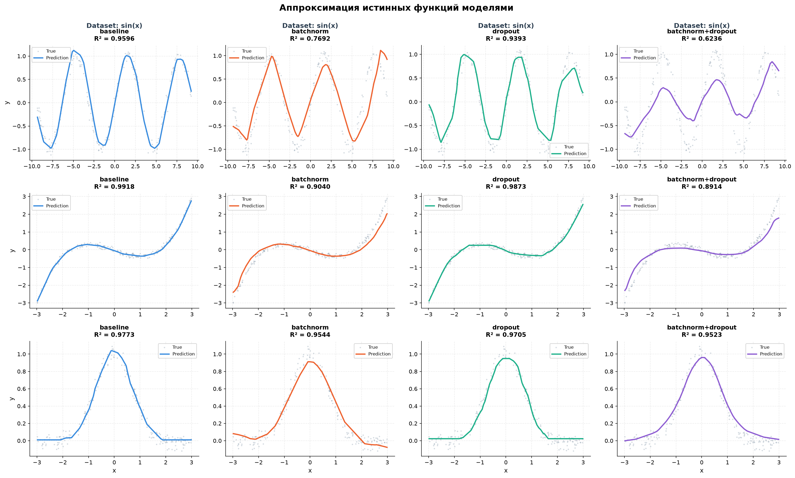

# Отчёт по лабораторной работе DL Lab 1
## Влияние BatchNorm и Dropout на нелинейную регрессию

## 1. Задача

Сгенерировать 3 случайные нелинейные регрессии и обучить модель на 4 конфигурациях:
1. Без Dropout, без BatchNorm
2. Только BatchNorm
3. Только Dropout
4. BatchNorm + Dropout

Сравнить: loss curves, предсказания, переобучение, время обучения.

## 2. Датасеты

| Датасет | Функция | x-диапазон | y-диапазон | Шум |
|---|---|---|---|---|
| sin(x) | sin(x) + шум | [-9.34, 9.42] | [-1.15, 1.24] | σ=0.1 |
| x³ - 3x | (x³ - 3x) + шум, нормализована | [-2.99, 2.99] | [-3.01, 3.10] | σ=0.5 |
| exp(-x²) | exp(-x²) + шум | [-3.00, 2.99] | [-0.13, 1.12] | σ=0.05 |

Каждый датасет — 1000 точек. Train/val split: 80/20.

## 3. Архитектура модели

Одинаковая для всех конфигураций:

- **Параметров:** 4353
- **Активация:** ReLU
- **Loss:** MSELoss
- **Оптимизатор:** Adam (lr=0.01)
- **Epochs:** 500
- **Batch size:** 32
- **Dropout:** p=0.2

## 4. Результаты

### Loss curves

Верхний ряд — train loss, нижний — validation loss.

**Наблюдения:**
- **Baseline** сходится быстрее всех
- **BatchNorm** и **BN+Dropout** — самые шумные кривые
- **Dropout** занимает промежуточное положение

### Предсказания

3 датасета × 4 конфигурации. R² указан в заголовке каждой панели.

**Наблюдения:**
- **Baseline** почти идеально аппроксимирует все функции
- **BatchNorm** — предсказания смещены и колеблются
- **BN+Dropout** — наихудшее совпадение

### Итоговая таблица

| Dataset | Config | MSE | R² | Time (s) |
|---|---|---|---|---|
| sin(x) | baseline | 0.0199 | 0.9596 | 27.86 |
| sin(x) | batchnorm | 0.1134 | 0.7692 | 38.21 |
| sin(x) | dropout | 0.0298 | 0.9393 | 32.75 |
| sin(x) | batchnorm+dropout | 0.1849 | 0.6236 | 48.27 |
| x³ - 3x | baseline | 0.0076 | 0.9918 | 38.43 |
| x³ - 3x | batchnorm | 0.0885 | 0.9040 | 53.81 |
| x³ - 3x | dropout | 0.0117 | 0.9873 | 43.11 |
| x³ - 3x | batchnorm+dropout | 0.1001 | 0.8914 | 57.90 |
| exp(-x²) | baseline | 0.0027 | 0.9773 | 35.84 |
| exp(-x²) | batchnorm | 0.0054 | 0.9544 | 50.04 |
| exp(-x²) | dropout | 0.0035 | 0.9705 | 40.64 |
| exp(-x²) | batchnorm+dropout | 0.0057 | 0.9523 | 54.31 |

## 5. Анализ переобучения

Gap = val_loss − train_loss на 500-й эпохе:

| Dataset | Config | Gap | Overfit |
|---|---|---|---|
| sin(x) | baseline | +0.0027 | No |
| sin(x) | batchnorm | +0.0127 | No |
| sin(x) | dropout | -0.0607 | No |
| sin(x) | batchnorm+dropout | -0.1211 | No |
| x³ - 3x | baseline | -0.0029 | No |
| x³ - 3x | batchnorm | +0.0470 | No |
| x³ - 3x | dropout | -0.0290 | No |
| x³ - 3x | batchnorm+dropout | -0.0618 | No |
| exp(-x²) | baseline | -0.0000 | No |
| exp(-x²) | batchnorm | -0.0061 | No |
| exp(-x²) | dropout | -0.0027 | No |
| exp(-x²) | batchnorm+dropout | -0.0169 | No |

**Переобучения нет ни в одной конфигурации** — все gap маленькие, модель недостаточно сложна для переобучения.

## 6. Выводы

### Основные результаты

1. **Переобучения нет ни в одной конфигурации** — train и val loss идут параллельно, gap ≤ 0.05. Простая 1D-регрессия с 4353 параметрами и 800 примерами — модель недостаточно сложна для переобучения.

2. **Baseline (без регуляризации) — лучший** по всем метрикам:
   - Самый низкий MSE (0.0027–0.0199)
   - Самый высокий R² (0.9596–0.9918)
   - Самое быстрое обучение (27–39 сек)

3. **BatchNorm ухудшает результат** на этой задаче:
   - R² падает с 0.96 до 0.77 (sin(x))
   - Обучение становится шумным
   - Время растёт на 30–40%
   
   Причина: BatchNorm эффективен при глубоких сетях (10+ слоёв), больших батчах (128+) и сложных задачах. У нас — мелкая сеть (3 слоя), малый батч (32), простая 1D-регрессия.

4. **Dropout почти не влияет:**
   - R² практически как у baseline (0.9393 vs 0.9596)
   - Замедляет обучение на 15–20%
   - При 500 эпохах успевает «догнать»

5. **BatchNorm + Dropout — худший результат:**
   - Самое медленное обучение (48–58 сек)
   - Самый высокий MSE
   - Комбинация двух регуляризаций избыточна

### Практические рекомендации

- Для **простых регрессионных задач** (1D, малая сеть, мало данных) — **baseline без регуляризации**
- **BatchNorm** — для глубоких CNN/ResNet
- **Dropout** — для больших сетей с риском переобучения
- **Регуляризация не бесплатна:** каждая техника замедляет обучение и может ухудшить результат, если применена не по назначению

## 7. Структура проекта
dl_lab1/
├── notebooks/
│ └── dl_lab1_regression.ipynb # основной ноутбук
├── results/ # графики (PNG)
│ ├── datasets.png
│ ├── loss_curves.png
│ └── predictions.png
├── README.md
├── report.md
└── requirements.txt

## 8. Артефакты

- **GitHub:** https://github.com/1rizhik/dl_lab1